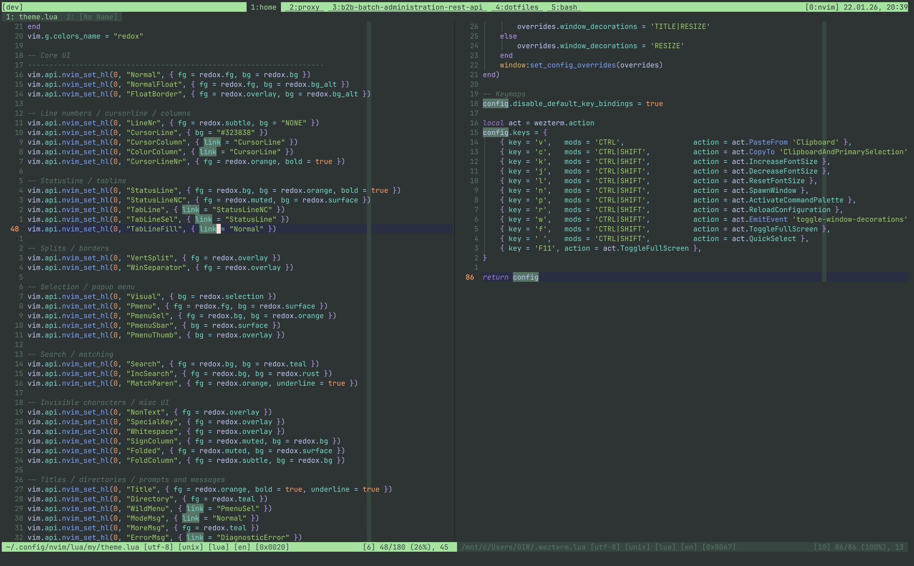
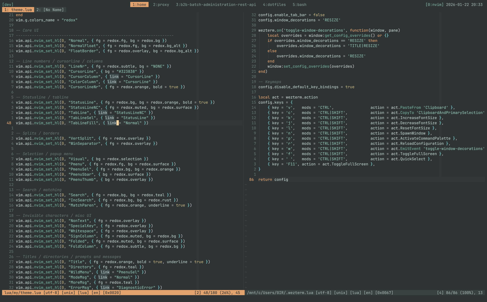

# Redox

Built around a gray/green base $\color{#2E3434}{\blacksquare}$ **#2E3434**,
with pastel gray/green and rust/orange accents.

## Neutrals (gray–green)

| Preview | Token | Hex | Intended use | Contrast vs bg (#2E3434) | AA (Normal) | AA (Large) |
|---:|:---|:---:|:---|:---:|:---:|:---:|
| $\color{#2E3434}{\blacksquare}$ | `bg` | `#2E3434` | Editor background | 1.00:1 | Fail | Fail |
| $\color{#343A3A}{\blacksquare}$ | `bg_alt` | `#343A3A` | Alt surfaces (floats/panes) | 1.09:1 | Fail | Fail |
| $\color{#3A4141}{\blacksquare}$ | `surface` | `#3A4141` | Statuslines/menus | 1.21:1 | Fail | Fail |
| $\color{#414949}{\blacksquare}$ | `overlay` | `#414949` | Borders/disabled | 1.37:1 | Fail | Fail |
| $\color{#DCE8E5}{\blacksquare}$ | `fg` | `#DCE8E5` | Primary text | 10.09:1 | Pass | Pass |
| $\color{#AFC3BE}{\blacksquare}$ | `muted` | `#AFC3BE` | Secondary text | 6.86:1 | Pass | Pass |
| $\color{#919D9B}{\blacksquare}$ | `subtle` | `#919D9B` | Comments/line numbers | 4.53:1 | Pass | Pass |

## Accents (pastel)

| Preview | Token | Hex | Suggested usage | Contrast vs bg (#2E3434) | AA (Normal) | AA (Large) |
|---:|:---|:---:|:---|:---:|:---:|:---:|
| $\color{#CD8B64}{\blacksquare}$ | `rust` | `#CD8B64` | Primary accent | 4.51:1 | Pass | Pass |
| $\color{#E3A36F}{\blacksquare}$ | `orange` | `#E3A36F` | Keywords/active tab | 5.88:1 | Pass | Pass |
| $\color{#7EC1AE}{\blacksquare}$ | `teal` | `#7EC1AE` | Functions | 6.11:1 | Pass | Pass |
| $\color{#9FD8C4}{\blacksquare}$ | `sea` | `#9FD8C4` | Strings | 7.90:1 | Pass | Pass |
| $\color{#8FC7B7}{\blacksquare}$ | `cyan` | `#8FC7B7` | Info | 6.65:1 | Pass | Pass |
| $\color{#D6C38A}{\blacksquare}$ | `amber` | `#D6C38A` | Types/numbers | 7.26:1 | Pass | Pass |
| $\color{#CD8980}{\blacksquare}$ | `red` | `#CD8980` | Errors | 4.52:1 | Pass | Pass |
| $\color{#E3B86F}{\blacksquare}$ | `warn` | `#E3B86F` | Warnings | 6.85:1 | Pass | Pass |
| $\color{#FFD7A0}{\blacksquare}$ | `cursor` | `#FFD7A0` | Cursor/selection foreground | 9.34:1 | Pass | Pass |
| $\color{#3F4A4A}{\blacksquare}$ | `selection` | `#3F4A4A` | Visual selection background | 1.38:1 | Fail | Fail |
| $\color{#8EC6C4}{\blacksquare}$ | `info` | `#8EC6C4` | Diagnostic info | 6.65:1 | Pass | Pass |
| $\color{#98C3B1}{\blacksquare}$ | `hint` | `#98C3B1` | Diagnostic hint | 6.50:1 | Pass | Pass |

## Terminal ANSI 16-color mapping

| Index | Name | Preview | Hex | ANSI FG Code | ANSI BG Code |
|:--:|:--|---:|:---:|:---:|:---:|
| `0`  | `black`        | $\color{#2E3434}{\blacksquare}$ | `#2E3434` | `\x1b[30m` | `\x1b[40m` |
| `8`  | `brightBlack`  | $\color{#4A5353}{\blacksquare}$ | `#4A5353` | `\x1b[90m` | `\x1b[100m` |
| `1`  | `red`          | $\color{#CD8980}{\blacksquare}$ | `#CD8980` | `\x1b[31m` | `\x1b[41m` |
| `9`  | `brightRed`    | $\color{#E08A7F}{\blacksquare}$ | `#E08A7F` | `\x1b[91m` | `\x1b[101m` |
| `2`  | `green`        | $\color{#7FB8A4}{\blacksquare}$ | `#7FB8A4` | `\x1b[32m` | `\x1b[42m` |
| `10` | `brightGreen`  | $\color{#A9D6C6}{\blacksquare}$ | `#A9D6C6` | `\x1b[92m` | `\x1b[102m` |
| `3`  | `yellow`       | $\color{#D6C38A}{\blacksquare}$ | `#D6C38A` | `\x1b[33m` | `\x1b[43m` |
| `11` | `brightYellow` | $\color{#EBD9A8}{\blacksquare}$ | `#EBD9A8` | `\x1b[93m` | `\x1b[103m` |
| `4`  | `blue`         | $\color{#6FAFBD}{\blacksquare}$ | `#6FAFBD` | `\x1b[34m` | `\x1b[44m` |
| `12` | `brightBlue`   | $\color{#92CAD4}{\blacksquare}$ | `#92CAD4` | `\x1b[94m` | `\x1b[104m` |
| `5`  | `magenta`      | $\color{#B28FA3}{\blacksquare}$ | `#B28FA3` | `\x1b[35m` | `\x1b[45m` |
| `13` | `brightMagenta`| $\color{#D3ABC0}{\blacksquare}$ | `#D3ABC0` | `\x1b[95m` | `\x1b[105m` |
| `6`  | `cyan`         | $\color{#8FC7B7}{\blacksquare}$ | `#8FC7B7` | `\x1b[36m` | `\x1b[46m` |
| `14` | `brightCyan`   | $\color{#B6E3D5}{\blacksquare}$ | `#B6E3D5` | `\x1b[96m` | `\x1b[106m` |
| `7`  | `white`        | $\color{#DCE8E5}{\blacksquare}$ | `#DCE8E5` | `\x1b[37m` | `\x1b[47m` |
| `15` | `brightWhite`  | $\color{#F1F6F4}{\blacksquare}$ | `#F1F6F4` | `\x1b[97m` | `\x1b[107m` |

## Notes

- Keep accents low-saturation to retain the calm, pastel look; the table shows
  WCAG contrast ratios against the background `#2E3434` for guidance.
- For long-form text, prefer `fg` over `muted`; use `subtle` for non-critical
  UI like gutters.
- When using `selection` as a background, ensure foreground text uses `fg` for
  readability.

# Tmp

Comparing old and new theme:

## Old

## New

